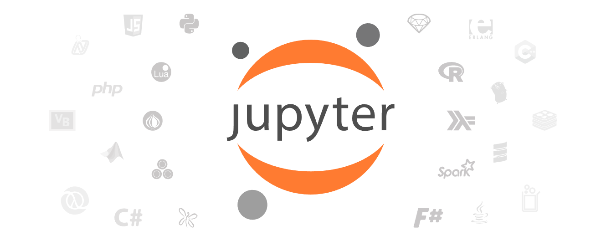

# reconstrue/shell

This repo contains code for working with Jupyter as the main developer interface.

The tasks enriched by this code are focused around neuroscience.
- Image processing of neurons
- UI widgets
  - Volumetric views that work in Jupyter, especially Colab
  - Eight-bit histograms for image intensities
  - Datashader
- Platform basis 
  - Allen SDK
  - Colab VM stats
  - Python-to-R-and-back
  - git
  - unit-testing in notebooks
  
img src="https://reconstrue.github.io/shell/ui/eight_bit_dual_gauge.png" />
